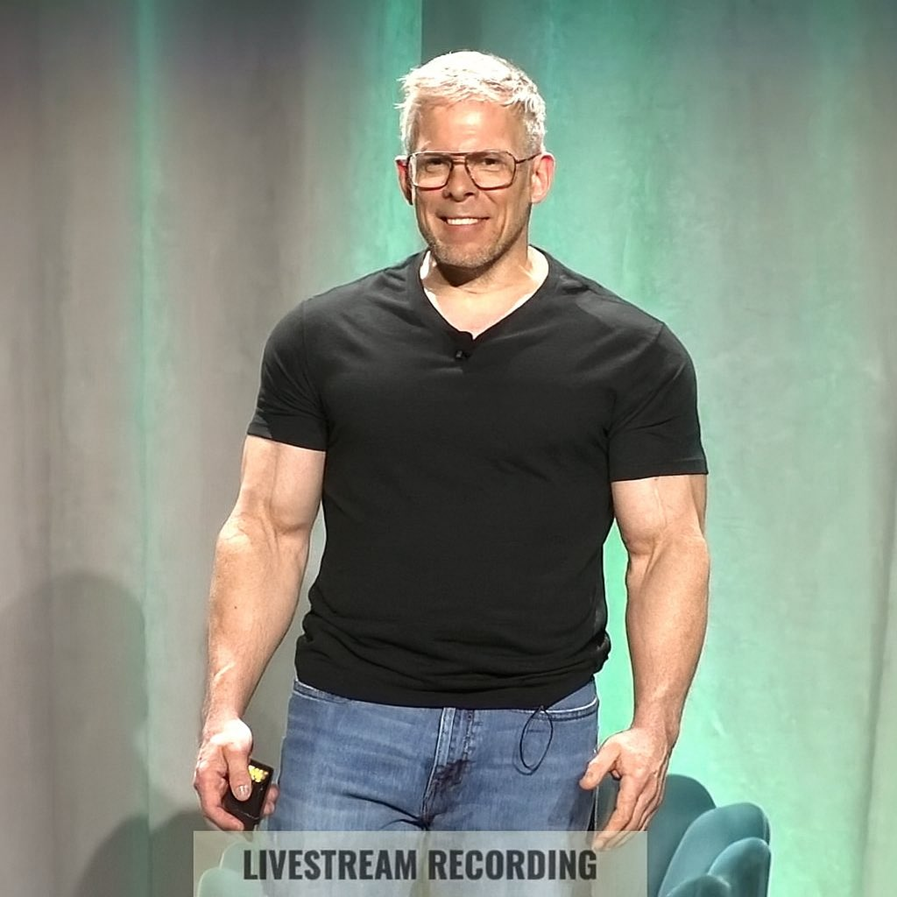

Hi! I’m Ali Rezaei!

Full-stack & ML engineer building reliable, production-first prototypes and research tools. I focus on practical systems: data pipelines, ML infra, real-time / embedded demos, and research code that’s easy to reproduce.

## Featured Projects

| Project | Description |
| --- | --- |
| [SWOT-LLM](https://github.com/AliRezaei-Code/SWOT-LLM) | RAG + evaluation stack for humanitarian water engineering (Safe Water Optimization). LLM infra, retrieval, and front-end in one place. |
| [SurveilChain – Real-Time Crypto Market Surveillance](https://github.com/AliRezaei-Code/SurveilChain--Real-Time-Crypto-Market-Surveillance-Platform) | Streaming ingestion, anomaly detection, and alerting for crypto markets. Data pipelines and real-time systems. |
| [Assurance-Insight-Copilot](https://github.com/AliRezaei-Code/Assurance-Insight-Copilot) | Domain-specific AI copilot for assurance / risk work: retrieval, tool-calling, and evaluation harnesses. |
| [Orbital-Arm-Sensor-Console](https://github.com/AliRezaei-Code/Orbital-Arm-Sensor-Console) | C++ telemetry and visualization console for a robotic arm. Embedded-style, real-time sensor pipelines. |
| [OpenCV-prototypes](https://github.com/AliRezaei-Code/OpenCV-prototypes) | Computer vision playground: tracking, filters, and small demos for practical systems and prototypes. |
| [TAMMI 2.0](https://github.com/AliRezaei-Code/tammi-khaled) | Morphological complexity analysis toolkit with CLI, modular Python package, and docs; refactors the original TAMMI notebook for scalable batch processing. |
| [EECS3311F25/project-runion](https://github.com/EECS3311F25/project-runion) | RUNION mobile app plus EECS3311 course deliverables and documentation. |

## Other Notable Repos

| Repo | Description |
| --- | --- |
| [Toyota-GR-Hack-the-Track–Ising-Decision-Maker](https://github.com/AliRezaei-Code/Toyota-GR-Hack-the-Track--Ising-Decision-Maker-) | Motorsports telematics and decision heuristics (Ising-style) for Toyota’s Hack the Track. |
| [Trustworthy-Credit-Risk-Scoring-with-Tractable-Probabilistic-Circuits](https://github.com/AliRezaei-Code/Trustworthy-Credit-Risk-Scoring-with-Tractable-Probabilistic-Circuits) | Structured probabilistic ML for credit risk; strong math/ML for finance signal. |
| [audio_anonymizer](https://github.com/AliRezaei-Code/audio_anonymizer) | C++ tool for pitch/tempo/noise-based anonymization; privacy + DSP + systems. |
| [ResolveFormatTool](https://github.com/AliRezaei-Code/ResolveFormatTool) | FFmpeg-based C++ utility for producing DaVinci Resolve–friendly formats (CLI and cross-platform tooling). |
| [llama2.c](https://github.com/AliRezaei-Code/llama2.c) | Experiments, finetuning, and evaluations around Karpathy’s llama2.c. |
| [The-Ops-Kit](https://github.com/AliRezaei-Code/The-Ops-Kit) | Lightweight templates for configuration capture, change logging, and stakeholder status updates. |
| [javapp-accoutning-](https://github.com/AliRezaei-Code/javapp-accoutning-) | Java accounting app. **Languages & Tools:** Java, Docker. **Frameworks & libs:** Spring Boot (Web, Data JPA), Hibernate, Flyway, H2, PostgreSQL, JavaFX, Jackson, AtlantisFX, Ikonli, Jakarta Persistence, JUnit 5. **Build:** Gradle (Kotlin DSL), Java 21.   |
| [ChainOps-Lab](https://github.com/AliRezaei-Code/ChainOps-Lab) | Python, Java, Solidity, Docker experiments around blockchain operations. |
| [LogiFlow-AI](https://github.com/AliRezaei-Code/LogiFlow-AI) | AI-powered logistics workflow manager.   |

 Experience (full resume available on request)
- Software & ML Engineer, Dahdaleh Institute for Global Health Research - Sep 2025 - Present  
- Researcher (NSERC Award), Computational Neuroscience - May 2025 - Aug 2025  
- Cybersecurity Engineer, 8 Limbs Consultancy - Feb 2025 - Present  
- SWE & ML Engineer, DRDC - May 2023 - Sep 2024

 Contact
- Email: ali0rezaei0@gmail.com  
- LinkedIn: https://www.linkedin.com/in/ali-r-652a79170  
- Site: https://rezaei.agency

## My GitHub Stats

## Connect with Me
  

---

## Tech Pantheon! (for fun)

A  nod to the legends that shaped how I think about software.

  

    
  

  

    
  

  

    
  

Richard Stallman : Free Software Foundation founder and GNU creator. 
Gabe Newell : Valve cofounder who launched Steam and pushed PC gaming forward. 
John Carmack : id Software cofounder and 3D graphics pioneer behind Doom and Quake.

---

